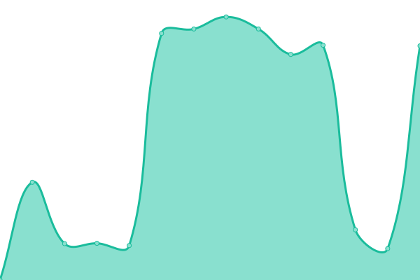
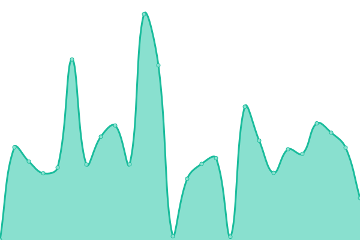

# [📈 Live Status](https://uptime.georgedong.tech): <!--live status--> **🟩 All systems operational**

This repository contains the open-source uptime monitor and status page for [George·Dong](https://uptime.georgedong.tech), powered by [Upptime](https://github.com/upptime/upptime).

With [Upptime](https://upptime.js.org), you can get your own unlimited and free uptime monitor and status page, powered entirely by a GitHub repository. We use [Issues](https://github.com/GeorgeDong32/upptime/issues) as incident reports, [Actions](https://github.com/GeorgeDong32/upptime/actions) as uptime monitors, and [Pages](https://uptime.georgedong.tech) for the status page.

<!--start: status pages-->
<!-- This summary is generated by Upptime (https://github.com/upptime/upptime) -->
<!-- Do not edit this manually, your changes will be overwritten -->
<!-- prettier-ignore -->
| URL | Status | History | Response Time | Uptime |
| --- | ------ | ------- | ------------- | ------ |
|  Bitwarden Service | 🟩 Up | [bitwarden-service.yml](https://github.com/GeorgeDong32/upptime/commits/HEAD/history/bitwarden-service.yml) | 

 5631ms
     
 | 

<a href="https://uptime.georgedong.tech/history/bitwarden-service">98.49%</a>
    

|  Image Storage 1 | 🟩 Up | [image-storage-1.yml](https://github.com/GeorgeDong32/upptime/commits/HEAD/history/image-storage-1.yml) | 

 1270ms
     
 | 

<a href="https://uptime.georgedong.tech/history/image-storage-1">99.90%</a>
    

|  Shortlink Service | 🟩 Up | [shortlink-service.yml](https://github.com/GeorgeDong32/upptime/commits/HEAD/history/shortlink-service.yml) | 

 2807ms
     
 | 

<a href="https://uptime.georgedong.tech/history/shortlink-service">100.00%</a>
    

|  Emergency Plan | 🟩 Up | [emergency-plan.yml](https://github.com/GeorgeDong32/upptime/commits/HEAD/history/emergency-plan.yml) | 

 476ms
     
 | 

<a href="https://uptime.georgedong.tech/history/emergency-plan">99.43%</a>
    

|  Tailscale | 🟩 Up | [tailscale.yml](https://github.com/GeorgeDong32/upptime/commits/HEAD/history/tailscale.yml) | 

 146ms
     
 | 

<a href="https://uptime.georgedong.tech/history/tailscale">100.00%</a>
    

|  Status Page on Better Stack | 🟩 Up | [status-page-on-better-stack.yml](https://github.com/GeorgeDong32/upptime/commits/HEAD/history/status-page-on-better-stack.yml) | 

 975ms
     
 | 

<a href="https://uptime.georgedong.tech/history/status-page-on-better-stack">100.00%</a>
    

<!--end: status pages-->

[**Visit our status website →**](https://uptime.georgedong.tech)

## 📄 License

- Powered by: [Upptime](https://github.com/upptime/upptime)
- Code: [MIT](./LICENSE) © [George·Dong](https://uptime.georgedong.tech)
- Data in the `./history` directory: [Open Database License](https://opendatacommons.org/licenses/odbl/1-0/)
