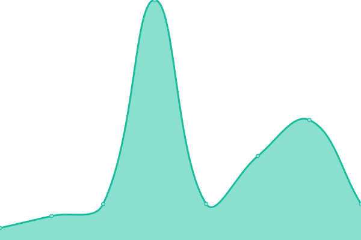
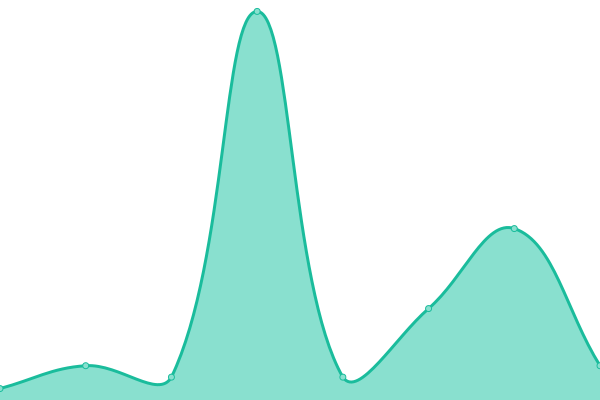
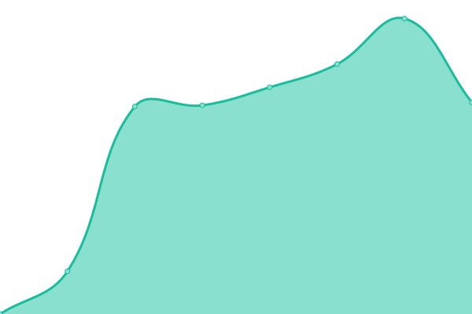
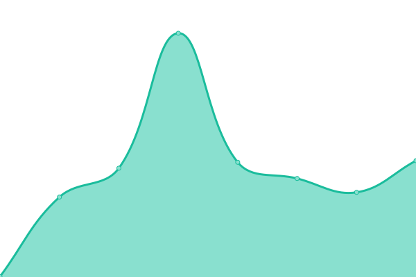
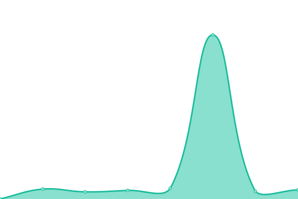
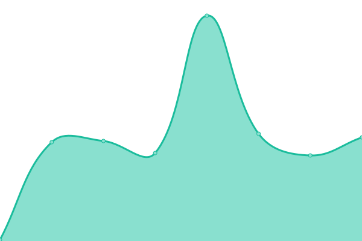
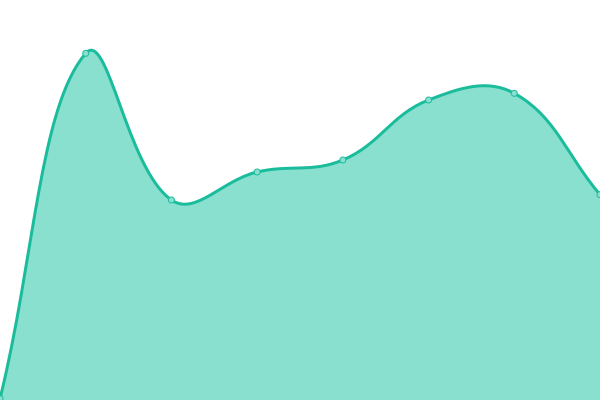

# [📈 Live Status](https://uptime.georgedong.tech): <!--live status--> **所有服务均正常运行**

This repository contains the open-source uptime monitor and status page for [George·Dong](https://uptime.georgedong.tech), powered by [Upptime](https://github.com/upptime/upptime).

With [Upptime](https://upptime.js.org), you can get your own unlimited and free uptime monitor and status page, powered entirely by a GitHub repository. We use [Issues](https://github.com/GeorgeDong32/upptime/issues) as incident reports, [Actions](https://github.com/GeorgeDong32/upptime/actions) as uptime monitors, and [Pages](https://uptime.georgedong.tech) for the status page.

<!--start: status pages-->
<!-- This summary is generated by Upptime (https://github.com/upptime/upptime) -->
<!-- Do not edit this manually, your changes will be overwritten -->
<!-- prettier-ignore -->
| 网站 | 状态 | 历史信息 | 响应时间 | 正常运行时间 |
| --- | ------ | ------- | ------------- | ------ |
|  Light Server | 🟩 正常运行 | [light-server.yml](https://github.com/GeorgeDong32/upptime/commits/HEAD/history/light-server.yml) | 

 5ms
     
 | 

<a href="https://uptime.georgedong.tech/history/light-server">100.00%</a>
    

|  Server-T1 | 🟩 正常运行 | [server-t1.yml](https://github.com/GeorgeDong32/upptime/commits/HEAD/history/server-t1.yml) | 

 5ms
     
 | 

<a href="https://uptime.georgedong.tech/history/server-t1">100.00%</a>
    

|  Bitwarden | 🟩 正常运行 | [bitwarden.yml](https://github.com/GeorgeDong32/upptime/commits/HEAD/history/bitwarden.yml) | 

 10681ms
     
 | 

<a href="https://uptime.georgedong.tech/history/bitwarden">100.00%</a>
    

|  Image Storage | 🟩 正常运行 | [image-storage.yml](https://github.com/GeorgeDong32/upptime/commits/HEAD/history/image-storage.yml) | 

 295ms
     
 | 

<a href="https://uptime.georgedong.tech/history/image-storage">100.00%</a>
    

|  [Blog](https://blog.georgedong.tech) | 🟩 正常运行 | [blog.yml](https://github.com/GeorgeDong32/upptime/commits/HEAD/history/blog.yml) | 

 389ms
     
 | 

<a href="https://uptime.georgedong.tech/history/blog">100.00%</a>
    

|  [Home Page](https://www.georgedong.tech) | 🟩 正常运行 | [home-page.yml](https://github.com/GeorgeDong32/upptime/commits/HEAD/history/home-page.yml) | 

 156ms
     
 | 

<a href="https://uptime.georgedong.tech/history/home-page">100.00%</a>
    

|  [GoodPass Site](https://goodpass.georgedong.tech) | 🟩 正常运行 | [good-pass-site.yml](https://github.com/GeorgeDong32/upptime/commits/HEAD/history/good-pass-site.yml) | 

 148ms
     
 | 

<a href="https://uptime.georgedong.tech/history/good-pass-site">100.00%</a>
    

|  Alist | 🟩 正常运行 | [alist.yml](https://github.com/GeorgeDong32/upptime/commits/HEAD/history/alist.yml) | 

 310ms
     
 | 

<a href="https://uptime.georgedong.tech/history/alist">100.00%</a>
    

|  [Status Page](https://status.georgedong.tech) | 🟩 正常运行 | [status-page.yml](https://github.com/GeorgeDong32/upptime/commits/HEAD/history/status-page.yml) | 

 1239ms
     
 | 

<a href="https://uptime.georgedong.tech/history/status-page">100.00%</a>
    

|  [Shortlink Service](https://go.georgedong.tech) | 🟩 正常运行 | [shortlink-service.yml](https://github.com/GeorgeDong32/upptime/commits/HEAD/history/shortlink-service.yml) | 

 159ms
     
 | 

<a href="https://uptime.georgedong.tech/history/shortlink-service">100.00%</a>
    

|  AI Chat | 🟩 正常运行 | [ai-chat.yml](https://github.com/GeorgeDong32/upptime/commits/HEAD/history/ai-chat.yml) | 

 197ms
     
 | 

<a href="https://uptime.georgedong.tech/history/ai-chat">100.00%</a>
    

|  Tailscale | 🟩 正常运行 | [tailscale.yml](https://github.com/GeorgeDong32/upptime/commits/HEAD/history/tailscale.yml) | 

 164ms
     
 | 

<a href="https://uptime.georgedong.tech/history/tailscale">100.00%</a>
    

|  Upptime Heartbeat | 🟩 正常运行 | [upptime-heartbeat.yml](https://github.com/GeorgeDong32/upptime/commits/HEAD/history/upptime-heartbeat.yml) | 

 272ms
     
 | 

<a href="https://uptime.georgedong.tech/history/upptime-heartbeat">100.00%</a>
    

<!--end: status pages-->

[**Visit our status website →**](https://uptime.georgedong.tech)

## 📄 License

- Powered by: [Upptime](https://github.com/upptime/upptime)
- Code: [MIT](./LICENSE) © [George·Dong](https://uptime.georgedong.tech)
- Data in the `./history` directory: [Open Database License](https://opendatacommons.org/licenses/odbl/1-0/)
